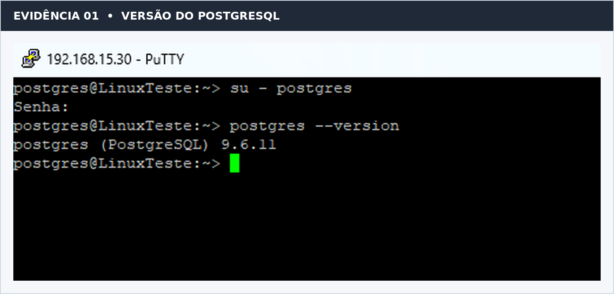
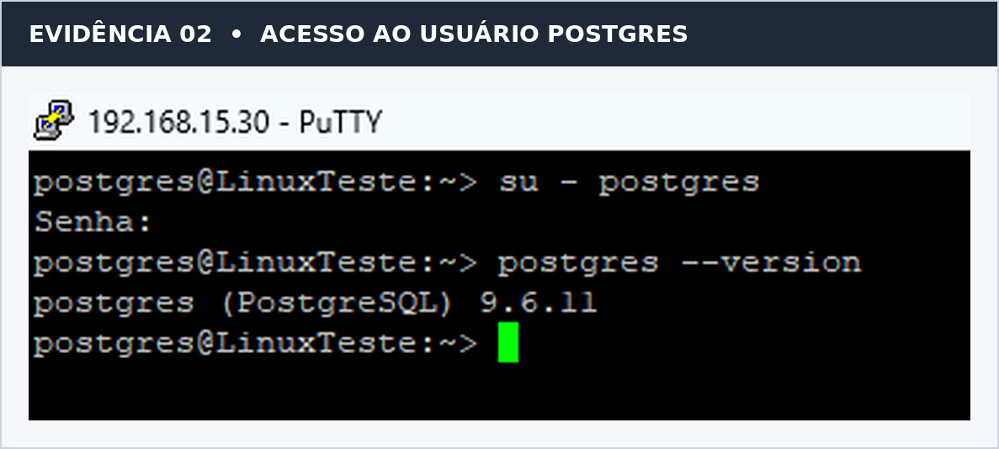
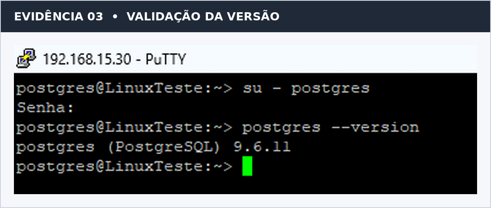
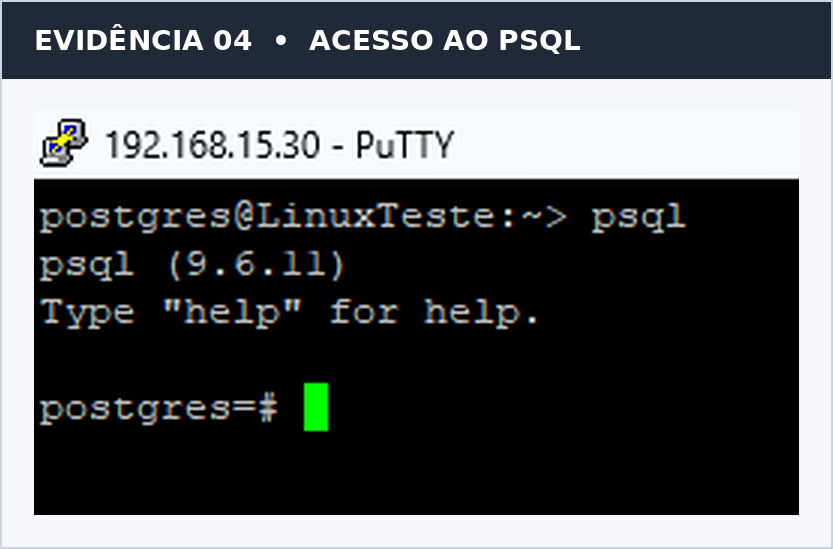
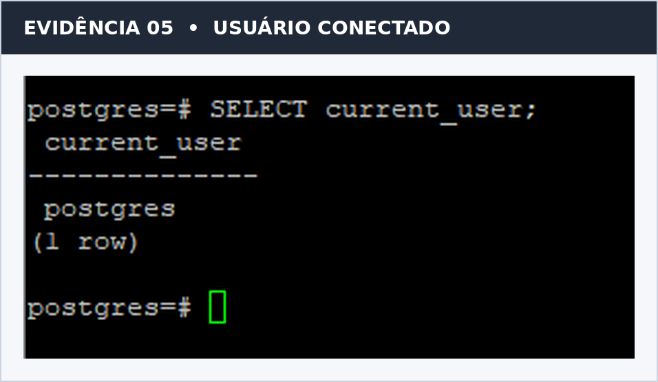
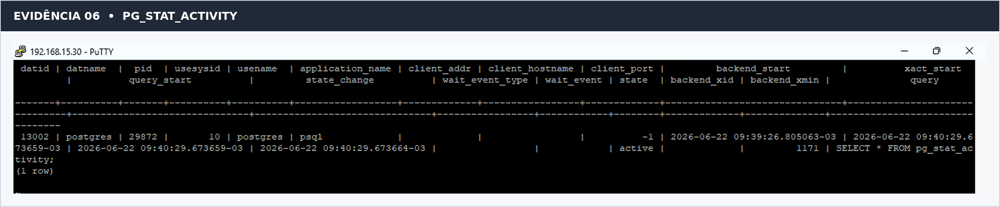
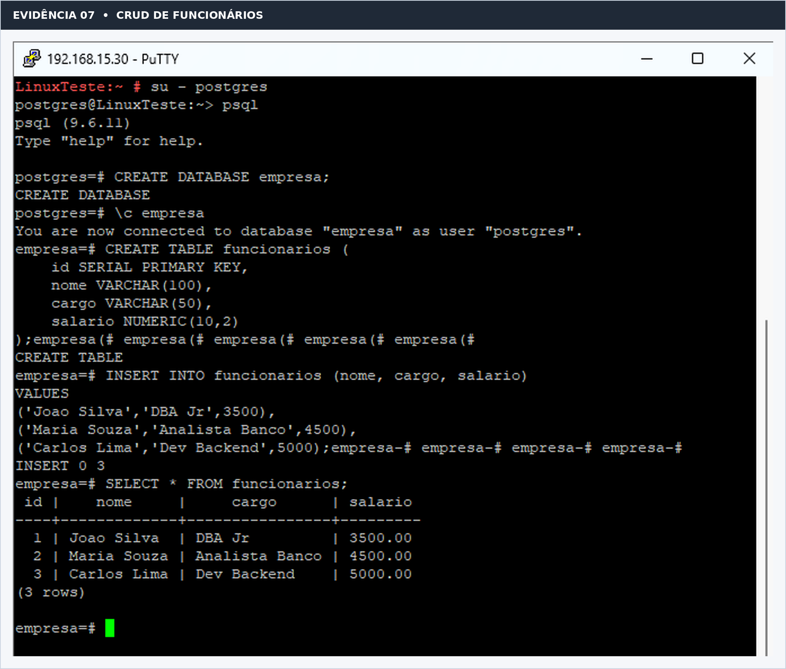
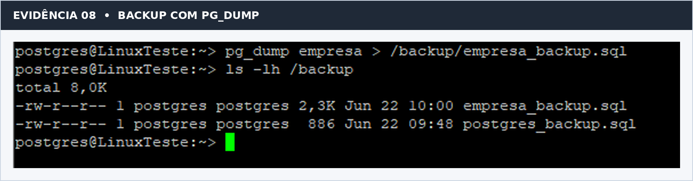
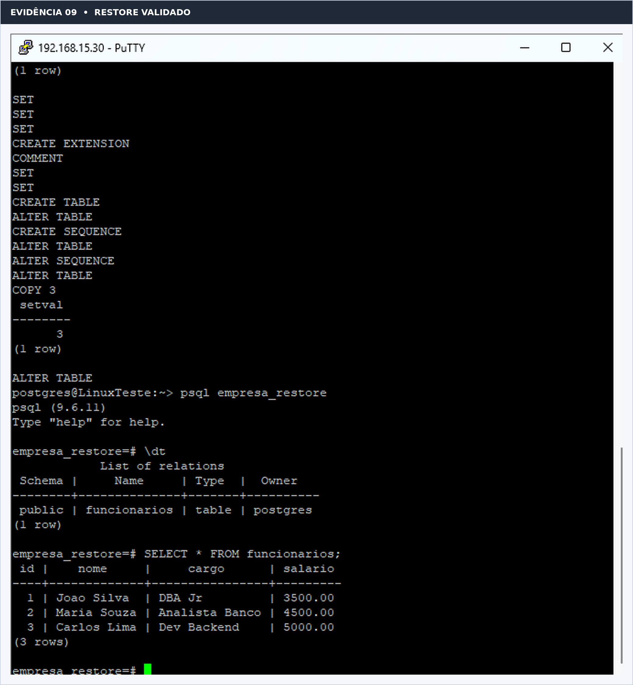

# 🐘 PostgreSQL DBA Lab

> Laboratório prático de administração do PostgreSQL em Linux, desenvolvido para demonstrar atividades de **DBA, infraestrutura, automação, backup, restauração, monitoramento e troubleshooting**.

[](https://www.postgresql.org/)
[](https://www.linux.org/)
[](https://www.gnu.org/software/bash/)
[](https://www.postgresql.org/)
[](LICENSE)

---

## 📌 Sobre o projeto

O **PostgreSQL DBA Lab** é um laboratório prático de administração de PostgreSQL em Linux, criado para transformar atividades técnicas em uma documentação organizada, reproduzível e adequada para **estudos, laboratório e portfólio profissional**.

O projeto reúne procedimentos e scripts para trabalhar com:

- 🐘 PostgreSQL;
- 🐧 Linux;
- 🛠️ Administração de bancos;
- 👤 Usuários e permissões;
- 🧾 SQL e operações CRUD;
- 📊 Monitoramento;
- 💾 Backup e restauração;
- ⚙️ Automação com Bash;
- 🔎 Troubleshooting.

> **Objetivo profissional:** demonstrar, de forma prática, conhecimentos essenciais para atuação com infraestrutura, banco de dados e administração PostgreSQL.

---

## 🎯 O que foi praticado

Durante o laboratório foram executadas e documentadas atividades como:

- acesso ao usuário de serviço `postgres`;
- acesso ao cliente `psql`;
- identificação da versão instalada;
- identificação do usuário conectado;
- consulta de sessões com `pg_stat_activity`;
- criação de banco de dados;
- criação de tabelas;
- inserção e consulta de registros;
- operações CRUD;
- backup lógico com `pg_dump`;
- restauração do banco;
- validação dos dados após restore;
- scripts Bash para backup, restore e monitoramento;
- tratamento de erros e uso de variáveis de ambiente.

---

## 🏗️ Estrutura do projeto

```text
postgresql-dba-lab/
│
├── administracao/
│   ├── criar-bancos.md
│   ├── criar-usuarios.md
│   └── permissoes.md
│
├── backup-restore/
│   ├── backup-logico.md
│   └── restore.md
│
├── docs/
│   └── evidencias/
│
├── instalacao/
│   └── instalacao-postgresql.md
│
├── monitoramento/
│   ├── consultas-performance.md
│   └── sessoes-ativas.md
│
├── scripts/
│   ├── backup_postgres.sh
│   ├── check_connections.sh
│   ├── monitor_postgres.sh
│   └── restore_postgres.sh
│
├── sql/
│   ├── 01_setup_lab.sql
│   ├── 02_validacao.sql
│   ├── 03_monitoramento.sql
│   └── 04_locks.sql
│
├── troubleshooting/
│   └── erros-comuns.md
│
├── CHANGELOG.md
├── CONTRIBUTING.md
├── LICENSE
├── README.md
└── SECURITY.md
```

---

## 🔄 Fluxo do laboratório

```text
🐧 Linux
   │
   ▼
🐘 Instalação / validação do PostgreSQL
   │
   ▼
👤 Usuário postgres + acesso ao psql
   │
   ▼
🧾 Banco + tabelas + dados
   │
   ▼
📊 Monitoramento e consultas
   │
   ▼
💾 Backup com pg_dump
   │
   ▼
♻️ Restore
   │
   ▼
✅ Validação da recuperação
   │
   ▼
⚙️ Automação com Bash
```

---

## 🖼️ Evidências do laboratório

As capturas foram organizadas e padronizadas para facilitar a leitura no GitHub, mantendo o conteúdo técnico original das evidências.

### 1️⃣ Versão do PostgreSQL



### 2️⃣ Acesso ao usuário PostgreSQL



### 3️⃣ Validação da versão



### 4️⃣ Acesso ao `psql`



### 5️⃣ Usuário conectado



### 6️⃣ Monitoramento com `pg_stat_activity`



### 7️⃣ CRUD de funcionários



### 8️⃣ Backup com `pg_dump`



### 9️⃣ Restore validado



📂 Todas as evidências estão disponíveis em [`docs/evidencias`](docs/evidencias/README.md).

---

## 💾 Backup e restauração

O projeto utiliza backup lógico com:

```bash
pg_dump -Fc
```

O formato customizado é apropriado para restauração utilizando:

```bash
pg_restore
```

Exemplo:

```bash
DB_NAME=empresa \
BACKUP_DIR="$HOME/backups/postgresql" \
./scripts/backup_postgres.sh
```

Para restaurar:

```bash
BACKUP_FILE="$HOME/backups/postgresql/empresa_YYYYMMDD_HHMMSS.dump" \
TARGET_DB=empresa_restore \
./scripts/restore_postgres.sh
```

O laboratório também contempla validação do backup e dos dados após a restauração.

---

## 📊 Monitoramento

O projeto possui consultas e scripts voltados para:

- sessões ativas;
- conexões;
- `pg_stat_activity`;
- locks;
- desempenho;
- tamanho dos bancos;
- queries em execução.

Exemplo:

```sql
SELECT *
FROM pg_stat_activity;
```

---

## ⚙️ Automação

Os scripts Bash foram organizados para executar tarefas administrativas de forma reutilizável.

Entre eles:

```text
backup_postgres.sh
check_connections.sh
monitor_postgres.sh
restore_postgres.sh
```

Os scripts utilizam práticas como:

```bash
set -Eeuo pipefail
```

Isso ajuda a tornar as execuções mais previsíveis e facilita o tratamento de falhas.

---

## 🔐 Segurança

Este projeto foi preparado para portfólio e laboratório.

Não devem ser publicados no repositório:

```text
❌ Senhas
❌ Chaves privadas
❌ Tokens
❌ Credenciais
❌ Backups reais
❌ Informações sensíveis
```

As credenciais devem ser fornecidas por mecanismos apropriados, como:

- `.pgpass`;
- variáveis protegidas de ambiente;
- gerenciadores de segredos.

Consulte [`SECURITY.md`](SECURITY.md) antes de publicar alterações.

---

## 🧰 Tecnologias utilizadas

| Tecnologia | Utilização |
|---|---|
| 🐘 PostgreSQL | Banco de dados |
| 🐧 Linux | Sistema operacional |
| 🐚 Bash | Automação |
| 🧾 SQL | Administração e consultas |
| 💾 `pg_dump` | Backup lógico |
| ♻️ `pg_restore` | Restauração |
| 📊 `pg_stat_activity` | Monitoramento |
| 🔒 Locks | Diagnóstico de concorrência |
| ⚙️ Shell Script | Automação de rotinas |

---

## 🚀 Como reproduzir

### Pré-requisitos

- Linux com Bash;
- PostgreSQL instalado;
- utilitários cliente PostgreSQL;
- usuário com permissões necessárias;
- espaço em disco para os backups.

### Clonar o projeto

```bash
git clone https://github.com/brmarks/postgresql-dba-lab.git
cd postgresql-dba-lab
```

### Criar os objetos do laboratório

```bash
psql -f sql/01_setup_lab.sql
```

### Validar os dados

```bash
psql -d empresa -f sql/02_validacao.sql
```

### Dar permissão aos scripts

```bash
chmod +x scripts/*.sh
```

### Executar backup

```bash
DB_NAME=empresa \
BACKUP_DIR="$HOME/backups/postgresql" \
./scripts/backup_postgres.sh
```

---

## 🧪 Validação

O laboratório contempla validações antes e depois das principais operações.

### Backup

```text
Banco
 ↓
pg_dump
 ↓
Arquivo de backup
 ↓
Validação
```

### Restore

```text
Backup
 ↓
pg_restore
 ↓
Banco de restauração
 ↓
Consultas
 ↓
Validação dos dados
```

---

## ⚠️ Limitações

As evidências deste laboratório foram produzidas em um ambiente de estudo utilizando **PostgreSQL 9.6.11**.

Para ambientes produtivos:

- utilize uma versão atualmente suportada;
- valide os procedimentos em homologação;
- revise comandos antes de executar alterações;
- mantenha uma estratégia adequada de backup e recuperação.

---

## 🚀 Próximas evoluções

- 💾 Backup físico;
- 🔄 Recuperação ponto no tempo (PITR);
- 🔁 Streaming Replication;
- 📊 Monitoramento com Prometheus;
- 📈 Dashboards com Grafana;
- ⏰ Automação com `systemd timer` ou `cron`;
- 🤖 Pipeline de validação com GitHub Actions;
- 🧹 ShellCheck para os scripts Bash;
- 🧪 Testes automatizados.

---

## 👨‍💻 Autor

**Matheus Barcelli**

Projeto desenvolvido como material de estudo, documentação técnica e portfólio na área de **Linux, PostgreSQL, infraestrutura, banco de dados e automação**.

---

## ⭐ Apoie o projeto

Se este projeto foi útil para você, considere deixar uma ⭐ no repositório.

---

## 📄 Licença

Distribuído sob a licença **MIT**.

Consulte [`LICENSE`](LICENSE) para mais informações.
