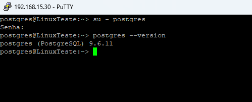
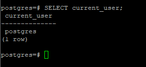
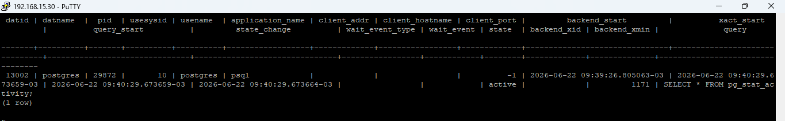
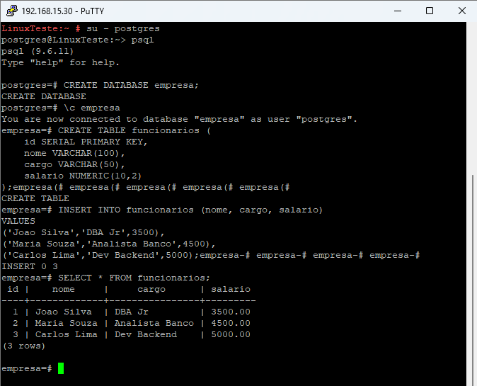
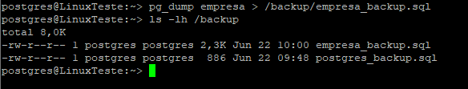
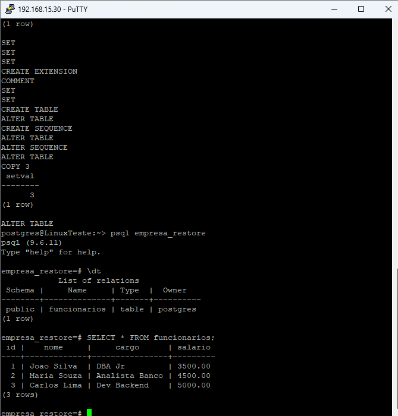

# PostgreSQL DBA Lab

[](https://www.postgresql.org/)
[](https://www.kernel.org/)
[](scripts/)
[](LICENSE)

Laboratório prático de administração de PostgreSQL em Linux, construído para demonstrar atividades essenciais de um profissional de infraestrutura e banco de dados: validação do ambiente, administração, SQL, monitoramento, backup, restauração, automação e troubleshooting.

> **Objetivo profissional:** transformar uma execução técnica real em documentação clara, reproduzível e segura para portfólio.

## Visão geral do projeto

Neste laboratório foram executadas e documentadas as seguintes etapas:

- acesso ao usuário de serviço `postgres` e ao cliente `psql`;
- identificação da versão instalada e do usuário conectado;
- consulta às sessões por meio de `pg_stat_activity`;
- criação de banco e tabela de exemplo;
- inserção e validação de dados;
- backup lógico com `pg_dump`;
- restauração em outro banco e validação de integridade;
- criação de scripts Bash reutilizáveis com logs e tratamento de erros.

## Evidências de execução

### 1. Validação do PostgreSQL e acesso ao `psql`



### 2. Consulta do usuário conectado



### 3. Monitoramento de sessões



### 4. Criação do banco, tabela e registros



### 5. Backup e restauração validados

| Backup lógico | Restore com dados validados |
|---|---|
|  |  |

Todas as capturas estão organizadas em [`docs/evidencias`](docs/evidencias/README.md).

## Arquitetura do repositório

```text
postgresql-dba-lab/
├── administracao/          # Bancos, usuários, privilégios e boas práticas
├── backup-restore/         # Estratégia, execução e validação de backups
├── docs/evidencias/        # Capturas reais do laboratório
├── instalacao/             # Checklist de instalação e validação
├── monitoramento/          # Consultas de sessões, locks e desempenho
├── scripts/                # Automações Bash reutilizáveis
├── sql/                    # Scripts SQL idempotentes e organizados
└── troubleshooting/        # Diagnóstico de falhas comuns
```

## Como reproduzir

### Pré-requisitos

- Linux com Bash;
- PostgreSQL e utilitários cliente instalados;
- usuário com permissão para criar banco e objetos;
- espaço em disco para os backups.

### Execução rápida

```bash
git clone https://github.com/brmarks/postgresql-dba-lab.git
cd postgresql-dba-lab

# Cria os objetos do laboratório
psql -f sql/01_setup_lab.sql

# Valida os dados
psql -d empresa -f sql/02_validacao.sql

# Executa backup em formato customizado
chmod +x scripts/*.sh
DB_NAME=empresa BACKUP_DIR="$HOME/backups/postgresql" ./scripts/backup_postgres.sh
```

Para restaurar o arquivo gerado:

```bash
BACKUP_FILE="$HOME/backups/postgresql/empresa_YYYYMMDD_HHMMSS.dump" \
TARGET_DB=empresa_restore \
./scripts/restore_postgres.sh
```

## Destaques técnicos

- uso de `set -Eeuo pipefail` nos scripts para falhar de forma previsível;
- variáveis de ambiente em vez de credenciais no código;
- backup em formato customizado (`pg_dump -Fc`), apropriado para `pg_restore`;
- retenção configurável dos arquivos de backup;
- validação pós-backup com `pg_restore --list`;
- criação de banco de restauração e teste de integridade dos registros;
- consultas úteis para sessões, locks, tamanho de bancos e queries em execução.

## Segurança

Este repositório não contém senhas, chaves privadas ou endereços públicos sensíveis. Credenciais devem ser fornecidas por mecanismos seguros, como `.pgpass`, variáveis protegidas do ambiente ou um gerenciador de segredos. Consulte [`SECURITY.md`](SECURITY.md).

## Limitações do laboratório

As evidências foram produzidas em um ambiente de estudo com PostgreSQL 9.6.11. Para ambientes produtivos, utilize uma versão atualmente suportada pela comunidade e valide os procedimentos em homologação antes de qualquer mudança.

## Próximas evoluções

- backup físico e recuperação ponto no tempo (PITR);
- replicação streaming;
- monitoramento com Prometheus e Grafana;
- execução automatizada por `systemd timer` ou `cron`;
- pipeline de validação com GitHub Actions e ShellCheck.

## Autor

**Matheus Barcelli**  
GitHub: [@brmarks](https://github.com/brmarks)  
LinkedIn: [matheusbarcelli](https://www.linkedin.com/in/matheusbarcelli/)

## Licença

Distribuído sob a licença MIT. Consulte [`LICENSE`](LICENSE).
